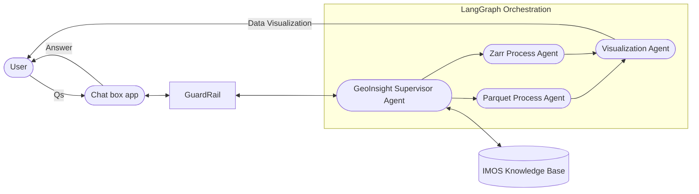

 Project Title
GeoInsight Agent: An AI-Powered Natural Language Interface for Dynamic Geospatial Data Exploration

2. Project Overview
We propose to develop an agentic AI system capable of interpreting natural language queries and generating interactive geospatial data visualizations directly from large-scale data stored in AWS S3, using formats like Parquet and Zarr. Users will ask questions such as:

“Hi, I am interested in the sea surface temperature near Storm Bay. What datasets could IMOS provided for my interest?”

The system will interpret the question, reason and list relevant IMOS datasets name (such as AusTemp Sea Surface Temperature and SRS-SST datasets) and information for users requirements.

“Ok, great! Could you plot that temperature changes near Storm Bay by using AusTemp Sea Surface Temperature over the last week?”

The system will reason, locate and load the relevant data (e.g., from Zarr AusTemp on S3), and return a plotted image or dashboard that could be shown on IMOS-Live portal. This system reduces the need for data users to write code or understand data formats, enabling self-service data analysis and exploratory insights through an AI assistant.

3. Objectives
Develop an IMOS Knowledge Base specific for IMOS AI agent to retrieve.

Develop an LLM-powered agent to translate natural language into geospatial data queries.

Integrate with AWS S3 to dynamically load Parquet/Zarr datasets.

Automate visualization generation (e.g., time series, spatial plots).

Deliver results through a web-based dashboard or chatbot interface.

Provide context-aware responses to refine queries and support analysis.

4. Scope
Included:
IMOS Knowledge Base for Geo-spatial Datasets

NLP → Data Query Translation

Spatial and temporal slicing of datasets

Plot generation (PNG, HTML, etc.)

Support for S3-stored Zarr and Parquet data

Front-end interface (demo app: Gradio)

Support chat-like conversation context

Not Included:
Real-time streaming data processing

Data ingestion pipelines (assumed pre-existing)

In-depth predictive modeling (focus is on visualization)

5. System Architecture Overview
🔧 Key Components
Layer

Tech/Service

LLM Agent & Orchestration

LangGraph, LangChain, AWS Nova, Claude

Integration & Context

Model Context Protocol (MCP), Retrieval-Augmented Generation (RAG)

AWS Services

AWS Bedrock, S3, ECS, Lambda

Data Access

S3, s3fs, boto3

Data Format

Zarr, Parquet

Geospatial Support

xarray, geopandas

Plotting

Matplotlib

Frontend

Gradio Application MVP

Backend/Orchestration

FastAPI, Docker, Prefect (depends), Terraform (optional)

Authentication (Optional)

1Password, AWS Secret Manager

6. User Flow
Example Use Case
User Prompt:

“Show me a line chart of sea-surface-temperature in Storm Bay over the past 7 days.”

LLM Agent Tasks:

Recognize variable: "sea-surface-temperature"

Retrieve metadata containing "sea-surface-temperature" from IMOS Knowledge Base

Choose the dataset: "AusTemp Sea Surface Temperature"

Recognize region: "Storm Bay" → lookup lat/lon bbox from IMOS Knowledge Base

Recognize time: "past 7 days" → resolve dates

Generate internal query and call plotting function

System Generates:

Python function for data slicing

Aggregated data (e.g., daily mean)

Plot image or HTML

User Output:

Visualization + explanation (e.g., average temp rose 1.2°C)

Option to ask follow-up questions (e.g., “Compare with previous month?”)

 

IMOS GeoInsight AI Agents Workflow 

GeoInsight AI Agents Workflow 
 

 

7. Milestones & Timeline
Phase

Description

Duration

Requirements & Data Setup

Identify datasets and index

1 week

IMOS Knowledge Base

Clean metadata and data index, embedding and vectoring to build Knowledge Base

1–2 weeks

Basic LLM Agent

AWS Bedrock LLM

1 week

Prompt Design for GeoInsight Agent

Created and tested initial prompts for an agent to validate geospatial metadata consistency

1 week

Milestone: launch IMOS knowledge based AI agent

The first IMOS-specific AI agent that was competed

1 week

Frontend

Gradio UI for POC

1 week

Testing, Model Fine-Tuning & Evaluation

Improve prompt coverage, fine-tuning the model and add error handling

1–2 weeks

Deployment

Dockerize, deploy to ECS/Lambda

1 week

Milestone: launch IMOS Data Visualization AI agent

Productionize the first IMOS Data Visualization AI agent

1 week

Total Estimated Time

 

9–11 weeks

8. Data Requirements
Zarr: the data product of AusTemp

Metadata/variable conventions (e.g., CF-convention, STAC optional)

POC variables: Sea Surface Temperature, Degree Heating Days, and Mosaic

9. Technical Challenges & Mitigation
Challenge

Mitigation

Scope Creep with Limited Resources

Defer secondary goals like multilingual support or fine-tuning until core is stable.

Ambiguity in prompts

LLM prompt engineering + few-shot examples

Geolocation from natural names

IMOS GeoServer and Gazetteer lookup (e.g., GeoNames or custom DB)

Visual clutter for large data

Set limitations of data plotting size or add aggregation, downsampling

Difficulty of AI Agent handling large dataset

Start and support small size datasets first

Security

S3 read-only policies, restrict prompt execution

10. Expected Impact
Enable non-technical users to query and explore scientific/geospatial data.

Accelerate data discovery by removing the need to write code.

Improve efficiency of analysis workflows across environmental, oceanographic, and climate sciences.

Lay groundwork for a generalizable LLM-agent architecture for other datasets.

11. Team & Roles
Role

Responsibility

Data Engineer (LeoLi)

AI application design, AI agents development, prompt engineering, S3 access with Parquet/Zarr processing, AWS Solution Design

Model Evaluation, MCP, AI agents tests, Prompt Security Check