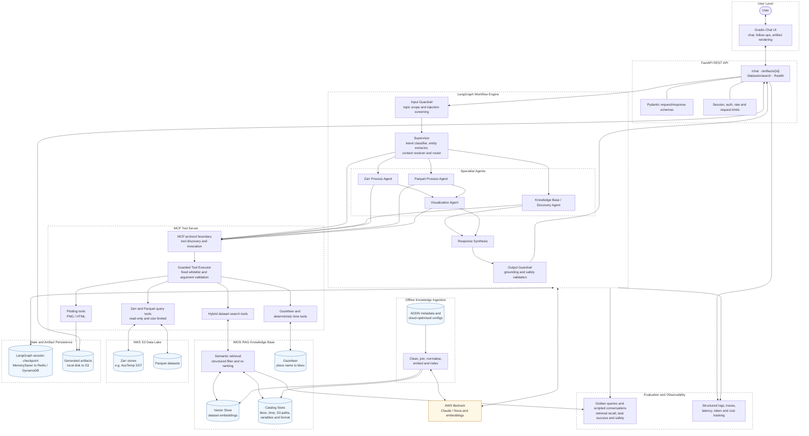

# GeoInsight Agent — System Design

> Companion to [project_proposal.md](./project_proposal.md). Data sources for the knowledge base are described in [data.md](./data.md).

## 1. Goals & Non-Goals

### Goals
- Answer natural-language questions about IMOS datasets ("What SST datasets cover Storm Bay?") via a RAG knowledge base.
- Translate NL requests into geospatial data queries (variable + spatial bbox + temporal range) against cloud-optimised Zarr/Parquet data on AWS S3.
- Generate visualizations (time series, spatial maps) returned through a chat interface (Gradio MVP).
- Maintain conversational context for follow-up queries.

### Non-Goals
- Real-time streaming, data ingestion pipelines, predictive modelling (per proposal scope).
- Write access to any data store (read-only system).

## 2. High-Level Architecture



### Component Responsibilities

| Component | Responsibility | Tech |
|---|---|---|
| Gradio UI | Chat interface, render plots, session handling | Gradio |
| FastAPI Backend | REST/WS endpoints, session store, auth, rate limiting | FastAPI, Docker |
| GuardRail | Prompt-injection screening, topic scoping, output PII/safety checks | Bedrock Guardrails or custom |
| Supervisor Agent | Intent classification, entity extraction (variable/place/time), routing, response synthesis | LangGraph + Bedrock (Claude) |
| KB/Discovery Agent | RAG retrieval over dataset metadata; answers "what datasets exist for X" | Vector store retriever |
| Zarr Process Agent | Resolve S3 Zarr path, lazy-open, slice by bbox/time, aggregate | xarray, zarr, s3fs |
| Parquet Process Agent | Predicate-pushdown reads of Parquet on S3 | pyarrow/pandas/geopandas, s3fs |
| Visualization Agent | Choose plot type, render PNG/HTML | matplotlib (+ optional plotly/folium) |
| MCP Tool Server | Expose discoverable domain tools through a standard protocol boundary; validate every invocation and enforce a fixed, read-only whitelist | MCP server + parameterised Python functions |
| Knowledge Base | Vector + structured metadata + gazetteer | See §3 |
| Offline Ingestion | Normalise AODN metadata/configs, create embeddings, and rebuild indexes repeatably | Python CLI, Bedrock embeddings |
| State & Artifacts | Persist follow-up context and generated visualizations | Memory/local disk (MVP) → Redis/DynamoDB/S3 |
| Evaluation & Observability | Measure retrieval/task/safety quality and track traces, latency, tokens, and cost | pytest golden sets, CloudWatch, LangSmith/Langfuse |

## 3. IMOS Knowledge Base (RAG)

The KB is the core differentiator: it grounds the agent in real IMOS catalog metadata so dataset discovery and data access paths are never hallucinated.

### 3.1 Sources (from docs/data.md)

1. **AODN Elasticsearch metadata** — `data/raw/imos_results.json` (~829 STAC-like dataset records). Each record contains:
   - `title`, `description`, `summaries["ai:description"]` — natural-language content for embedding
   - `extent.bbox`, `extent.temporal` — spatial/temporal coverage for structured filtering
   - `themes`, `parameter_vocabs`, `platform_vocabs`, `organisation_vocabs` — controlled vocabularies for variable matching (e.g. "sea surface temperature")
   - `links` — access endpoints; `id` — stable dataset UUID
2. **AODN Cloud Optimised configs** — JSON configs from [`aodn/aodn_cloud_optimised`](https://github.com/aodn/aodn_cloud_optimised/blob/main/aodn_cloud_optimised/config/) describing each cloud-optimised dataset: S3 location, format (Zarr/Parquet), schema/variables, chunking, dimensions. This is the bridge from "dataset chosen" → "how to actually open it".
3. **Gazetteer** — place name → bbox lookup (GeoNames subset / IMOS GeoServer / custom table for AU coastal features like "Storm Bay").

### 3.2 Ingestion Pipeline (offline, repeatable)

```
imos_results.json ─┐
                   ├─► clean/normalise ─► chunk ─► embed (Bedrock Titan/Cohere) ─► Vector Store
cloud-opt configs ─┘                 └─► extract structured fields ─► Catalog Store
```

1. **Clean & join**: link Elasticsearch records to cloud-optimised configs (by title/UUID matching). Records with a cloud-optimised config are flagged `queryable=true`; the rest are discoverable-only.
2. **Document construction**: one embedding document per dataset = title + ai:description + parameter/platform vocab terms. Keep documents whole where possible (descriptions are short); chunk only if > ~1.5k tokens.
3. **Metadata payload** stored alongside each vector: `{uuid, title, bbox, temporal_range, parameters[], platform[], s3_uri, format, variables[], queryable}` — used for filtered retrieval and passed directly to process agents.
4. **Embeddings**: Bedrock Titan Embeddings (or Cohere Embed on Bedrock).
5. **Vector store**: start with **ChromaDB or FAISS (local, in-container)** for MVP; migrate to **OpenSearch Serverless / pgvector on RDS** for production. 829 docs is tiny — local store is sufficient for POC.
6. **Catalog store**: same payloads in a lightweight queryable form (SQLite/DuckDB for MVP) for exact filters (bbox intersect, time overlap, parameter vocab match).

### 3.3 Retrieval Strategy

Hybrid retrieval, executed by the KB Agent:
1. **Semantic**: top-k (k≈10) vector search on the user's paraphrased need.
2. **Structured filter/re-rank**: filter by parameter vocab match, bbox intersection with resolved region, temporal overlap with resolved time range.
3. **Return** ranked candidates with metadata payloads; Supervisor presents options or auto-selects when confidence is high.

## 4. Agent Orchestration (LangGraph)

### 4.1 Graph State

```python
class AgentState(TypedDict):
    messages: list            # conversation history
    intent: str               # discovery | visualize | follow_up | out_of_scope
    variable: str | None      # e.g. "sea_surface_temperature"
    region: dict | None       # {name, bbox}
    time_range: dict | None   # {start, end}
    candidate_datasets: list  # KB retrieval results
    selected_dataset: dict | None
    data_ref: str | None      # path to sliced/aggregated intermediate data
    artifact: dict | None     # {type: png|html, path, caption}
    error: str | None
```

### 4.2 Flow

1. **GuardRail (in)** → reject off-topic/injection attempts.
2. **Supervisor**: classify intent; extract entities (variable, place, time) via tool-calling LLM. Resolve place→bbox via Gazetteer tool; resolve relative time ("past 7 days") deterministically in code, not by the LLM.
3. **Discovery path**: KB Agent retrieves candidates → Supervisor composes an answer listing datasets (title, coverage, access status). *(Milestone 1 deliverable)*
4. **Visualization path**: requires `selected_dataset.queryable`. Route by `format`:
   - **Zarr Agent**: `xr.open_zarr(s3fs_map, consolidated=True)` → `.sel(lat/lon slice, time slice)` → aggregate (e.g. daily/spatial mean) → enforce size cap.
   - **Parquet Agent**: pyarrow dataset scan with bbox/time predicates → dataframe.
5. **Visualization Agent**: pick plot type from data shape (1 spatial point/region-mean × time → line chart; lat×lon slice → pcolormesh map) → save PNG/HTML → caption with computed stats ("avg temp rose 1.2 °C").
6. **GuardRail (out)** → Supervisor returns answer + artifact to UI.
7. **Follow-ups** reuse state (`selected_dataset`, `region`) so "compare with previous month?" only changes `time_range`.

### 4.3 Key Design Decisions

- **No arbitrary code generation/execution.** Agents call a fixed toolbox of parameterised Python functions (`slice_zarr`, `query_parquet`, `plot_timeseries`, `plot_map`). The LLM supplies arguments only — eliminates sandbox/code-injection risk and matches the proposal's "restrict prompt execution" mitigation.
- **MCP is the tool protocol boundary, not the security boundary.** Agents discover and invoke domain tools through the MCP server, while the guarded executor independently validates schemas, applies the read-only allowlist, enforces data-size limits, and records tool calls. The same MCP tools can later serve other approved agent clients without duplicating domain logic.
- **Deterministic resolution where possible** (dates, bboxes, unit handling) — LLM only for language understanding and routing.
- **Data size guardrails**: estimate slice size from Zarr metadata before loading; refuse/downsample beyond a threshold (e.g. 100 MB or 1M points) per the proposal's visual-clutter mitigation.

## 5. API Design (FastAPI)

| Endpoint | Method | Purpose |
|---|---|---|
| `/chat` | POST/WS | `{session_id, message}` → streamed agent response + artifact refs |
| `/artifacts/{id}` | GET | Serve generated PNG/HTML |
| `/datasets/search` | GET | Direct KB search (debug/portal integration) |
| `/health` | GET | Liveness/readiness |

Sessions: in-memory dict for MVP → Redis/DynamoDB for production (LangGraph checkpointer).

## 6. Deployment

| Stage | Setup |
|---|---|
| **Local/POC** | Single Docker container: Gradio + FastAPI + local Chroma/SQLite KB; Bedrock via boto3; uv-managed Python project |
| **Production** | ECS Fargate service (API + agents), ALB; KB on OpenSearch Serverless/pgvector; artifacts to S3 + presigned URLs; Terraform IaC (optional per proposal); KB ingestion as scheduled ECS task or Lambda |

- **IAM**: task role with read-only S3 data access + `bedrock:InvokeModel`; secrets via AWS Secrets Manager.
- **Observability**: structured logs (CloudWatch), LangSmith/Langfuse traces for agent runs, per-session token/cost tracking.

## 7. Security

- Read-only S3 policies; no LLM-generated code execution (fixed tool whitelist).
- Bedrock Guardrails on input and output; topic scoping to IMOS/ocean data.
- Rate limiting + max tokens/session caps at FastAPI layer.
- No PII stored; sessions ephemeral by default.

## 8. Evaluation & Testing

- **KB retrieval**: golden set of ~30 query→expected-dataset pairs; measure recall@5.
- **Entity extraction**: unit tests for place/time/variable resolution (incl. edge cases: "last week", ambiguous places).
- **End-to-end**: scripted conversations against POC variables (SST, Degree Heating Days, Mosaic on AusTemp Zarr).
- **Prompt security**: injection test suite through GuardRail.
- **Tool layer**: pure-Python unit tests for slicing/plotting functions (no LLM needed).

## 9. Phased Delivery (mapped to proposal milestones)

| Phase | Deliverable |
|---|---|
| 1. KB build | Ingestion pipeline: imos_results.json + cloud-opt configs → vector + catalog stores |
| 2. Discovery agent | Supervisor + KB Agent answering dataset-discovery questions → **Milestone: IMOS knowledge-based AI agent** |
| 3. Data agents | Zarr/Parquet tools + Visualization agent on AusTemp SST |
| 4. UI + hardening | Gradio chat, guardrails, evaluation suite |
| 5. Deploy | Dockerize → ECS → **Milestone: IMOS Data Visualization AI agent** |

## 10. Open Questions

- Exact mapping coverage: how many of the 829 catalog records have cloud-optimised configs (determines `queryable` set)?
- Gazetteer source of truth: IMOS GeoServer vs. bundled GeoNames extract?
- Artifact rendering on IMOS portal (TBD): static PNG sufficient, or interactive HTML (plotly/folium) required?
- Bedrock model choice per role: Claude (Sonnet) for supervisor reasoning vs. Nova/Haiku for cheap extraction steps — cost/latency trade-off to benchmark.
