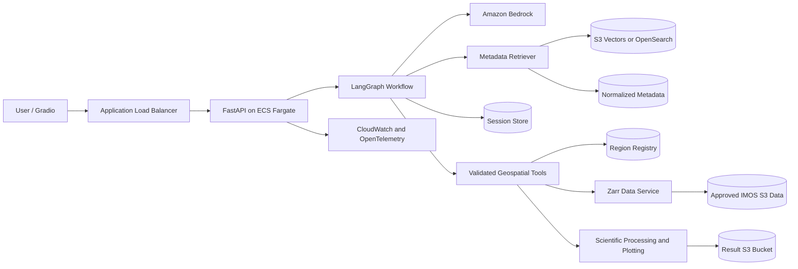

# GeoInsight AI System Design

## 1. Overview

GeoInsight AI is designed as a deterministic geospatial data platform with an
LLM orchestration layer. The LLM interprets user intent, selects approved
operations, and explains results. It does not generate or execute arbitrary
Python, shell commands, SQL, or unrestricted storage queries.

The initial proof of concept supports:

- Natural-language discovery of IMOS datasets.
- AusTemp sea surface temperature queries near Storm Bay.
- Absolute and relative time ranges.
- Bounded spatial and temporal selection from Zarr data in Amazon S3.
- Quality filtering, scientific aggregation, summary statistics, and PNG plots.
- Multi-turn conversation context.
- Deployment on AWS using Amazon Bedrock and ECS Fargate.

This design implements the boundaries defined in `docs/PRD.md`, particularly
the structured query-planning, resource-limit, security, and deployment
requirements.

## 2. Design Principles

1. **LLM for interpretation, code for enforcement**
   - The LLM extracts structured intent and selects approved operations.
   - Application code validates dataset IDs, variables, regions, dates,
     aggregations, and resource limits.

2. **No generated-code execution**
   - Model output is never passed to `exec`, `eval`, a shell, or an unrestricted
     query engine.

3. **Metadata-grounded answers**
   - Dataset recommendations are based on normalized IMOS metadata.
   - Responses retain references to the source metadata.

4. **Early and bounded data selection**
   - Spatial and temporal selection is applied before data is materialized.
   - Requests are rejected or narrowed before they can exhaust service
     resources.

5. **Dataset-specific scientific processing**
   - Variables, QC rules, valid ranges, units, and aggregation methods are
     controlled by reviewed processing profiles.

6. **Explicit workflow state**
   - LangGraph nodes have narrow responsibilities and exchange validated,
     structured state.

## 3. High-Level Architecture



### 3.1 Request Flow

1. The user submits a message through Gradio.
2. FastAPI assigns request and session identifiers.
3. LangGraph extracts and validates structured intent.
4. The retriever finds candidate datasets from normalized metadata.
5. Deterministic resolvers process location and time constraints.
6. A query-plan validator checks all parameters and resource limits.
7. The data service reads only the required Zarr subset from S3.
8. Scientific processing applies QC, aggregation, and downsampling.
9. Matplotlib generates a PNG and summary statistics.
10. The plot is stored in the result bucket and returned using an expiring URL.
11. Confirmed conversation constraints are persisted for follow-up requests.

## 4. AWS Architecture

### 4.1 Runtime

The FastAPI backend and Gradio proof-of-concept frontend are packaged as
containers and deployed to Amazon ECS using AWS Fargate.

ECS Fargate is preferred over Lambda because the application includes:

- Large scientific Python dependencies such as `xarray`, `numpy`, `zarr`, and
  `matplotlib`.
- Long-lived HTTP services.
- Requests that may approach the configured 60-second timeout.
- Memory requirements that vary with the selected data subset.

An Application Load Balancer provides HTTPS termination, health checks, and
HTTP routing. Container images are stored in Amazon ECR.

### 4.2 AWS Services

| Concern | AWS service |
|---|---|
| LLM and embeddings | Amazon Bedrock |
| Container runtime | Amazon ECS with AWS Fargate |
| Container images | Amazon ECR |
| HTTP entry point | Application Load Balancer |
| Source data | Amazon S3 |
| Normalized metadata | Versioned Amazon S3 objects |
| Vector retrieval | S3 Vectors initially; OpenSearch Serverless if required |
| Plot artifacts | Dedicated Amazon S3 result bucket |
| Session state | DynamoDB for deployed environments |
| Secrets | AWS Secrets Manager |
| Logs and metrics | Amazon CloudWatch |
| Tracing | OpenTelemetry, with optional LangSmith during development |
| Infrastructure | AWS CDK or Terraform |

### 4.3 Network Boundaries

- ECS tasks run in private subnets.
- The ALB is the only public or shared HTTP entry point.
- NAT or VPC endpoints provide access to required AWS services.
- Security groups allow inbound application traffic only from the ALB.
- The deployed POC must use an approved authentication mechanism before it is
  made externally reachable.

For shared access, Cognito or an existing OIDC provider should be integrated at
the ALB or application layer. AWS WAF and rate limiting should be added for a
public demonstration.

### 4.4 IAM

The ECS task role must use least privilege:

- Invoke only approved Bedrock model and embedding resources.
- Read only approved source-data S3 buckets and prefixes.
- Read normalized metadata.
- Write only to the result bucket and approved logging destinations.
- Read only required secrets.
- Access only the application session table.

Static AWS access keys must not be stored in the application configuration.

## 5. LangChain and LangGraph Design

LangChain provides model, embedding, retriever, tool, and structured-output
integrations. LangGraph provides the explicit orchestration workflow,
conditional routing, state persistence, and clarification interrupts.

### 5.1 Workflow

```text
START
  -> input_guard
  -> extract_intent
  -> merge_session_context
  -> retrieve_datasets
  -> resolve_region_and_dates
  -> validate_query_plan
  -> clarification_required? -> END
  -> load_data_subset
  -> apply_qc_and_aggregation
  -> generate_plot
  -> generate_grounded_response
  -> persist_context
  -> END
```

Each node performs one responsibility:

| Node | Responsibility |
|---|---|
| `input_guard` | Enforce request-size and basic input policies |
| `extract_intent` | Produce schema-validated intent using Bedrock |
| `merge_session_context` | Reuse confirmed constraints from the session |
| `retrieve_datasets` | Retrieve and rank matching metadata records |
| `resolve_region_and_dates` | Resolve approved regions and explicit UTC dates |
| `validate_query_plan` | Enforce allow-lists, coverage, and resource limits |
| `load_data_subset` | Read a bounded subset through the data-access contract |
| `apply_qc_and_aggregation` | Apply the reviewed processing profile |
| `generate_plot` | Produce a labelled PNG from the processed series |
| `generate_grounded_response` | Explain results using structured evidence |
| `persist_context` | Save confirmed constraints for follow-up requests |

### 5.2 Structured Intent

The LLM must return a Pydantic-validated object rather than free-form tool
arguments:

```python
from datetime import datetime
from typing import Literal

from pydantic import BaseModel


class QueryIntent(BaseModel):
    dataset_id: str | None
    variable: str | None
    region_name: str | None
    bbox: tuple[float, float, float, float] | None
    start_time: datetime | None
    end_time: datetime | None
    aggregation: Literal["daily_mean", "hourly_mean"] | None
    plot_type: Literal["time_series"] | None
    output_format: Literal["png"] = "png"
    unresolved_fields: list[str]
```

Model-provided dataset IDs, variables, coordinates, dates, and aggregations
remain untrusted until the query-plan validator approves them.

### 5.3 Graph State

Graph state should contain structured facts rather than a continuously growing
chat transcript:

- Current user message.
- Confirmed session constraints.
- Extracted intent.
- Candidate dataset records.
- Resolved region and UTC interval.
- Validated query plan.
- Data result metadata and statistics.
- Plot object key or URL.
- Sources, warnings, and machine-readable errors.

Large arrays, complete Zarr objects, PNG bytes, and unrestricted model messages
must not be persisted in graph state.

### 5.4 Clarification

The graph stops and requests clarification when:

- Dataset choice is materially ambiguous.
- A region has multiple plausible matches.
- The variable is missing or unsupported.
- No time range or documented default is available.
- The request exceeds configured limits.

LangGraph interrupts or an equivalent API-level state can preserve the pending
request until the user responds.

## 6. Metadata and Retrieval

### 6.1 Metadata Storage

Metadata has three representations:

1. **Raw metadata**
   - Immutable or versioned source records in S3.

2. **Normalized dataset registry**
   - Validated records following the PRD metadata schema.
   - Includes dataset identity, variables, units, spatial and temporal coverage,
     storage configuration, QC fields, and source references.

3. **Retrieval chunks**
   - Deterministic text chunks with structured filter metadata.
   - Embedded using the configured Bedrock embedding model.

### 6.2 Vector Store

For the initial metadata set, S3 Vectors with Amazon Bedrock Knowledge Bases is
the preferred managed option because it has low operational overhead and is
suited to cost-sensitive semantic retrieval.

OpenSearch Serverless should be selected instead when the project requires:

- Hybrid lexical and vector search.
- More advanced filtering or ranking.
- Lower retrieval latency at higher sustained query volume.
- Search behavior that cannot be achieved through application-level reranking.

This decision should be verified through retrieval evaluation rather than
chosen solely from infrastructure preference.

### 6.3 Retrieval Strategy

Vector similarity produces candidate datasets. Application code then performs
exact filtering and reranking.

An example scoring model is:

```text
final_score =
    semantic_similarity
    + exact_variable_match
    + spatial_intersection
    + temporal_coverage
    + supported_dataset_priority
```

Bounding-box intersection, temporal coverage, variable support, and storage
capability must not be inferred from vector similarity alone.

Every recommendation returns:

- Stable dataset ID and title.
- Relevant variables and units.
- Spatial and temporal evidence.
- Source metadata reference.
- Retrieval score or match explanation.

## 7. Region and Date Resolution

### 7.1 Region Registry

Required named regions are stored in a reviewed and versioned registry:

```yaml
region_id: storm_bay
display_name: Storm Bay
bbox: [min_longitude, min_latitude, max_longitude, max_latitude]
crs: EPSG:4326
source: approved-source-reference
version: 1
```

The LLM may identify the name `Storm Bay`, but it may not invent its
coordinates. Unknown and ambiguous region names produce a clarification or
controlled error.

### 7.2 Date Resolution

- Relative dates are resolved using the request timestamp.
- Internal boundaries use UTC.
- The response shows explicit dates.
- Inclusivity rules are consistent across parsing, data selection, plots, and
  tests.
- Dates outside dataset coverage are rejected before S3 access.

The exact interpretation of expressions such as "past 7 days" must be
documented and covered by deterministic tests.

## 8. Data Access and Scientific Processing

### 8.1 Processing Profiles

Each supported dataset-variable pair has a reviewed configuration:

```yaml
dataset_id: austemp_sst
storage_uri: s3://approved-bucket/approved-prefix/
storage_format: zarr
variables:
  sst:
    source_name: analysed_sst
    display_name: Sea Surface Temperature
    units: degree_Celsius
    valid_range: [-2, 40]
spatial_aggregation: area_weighted_mean
temporal_aggregation: daily_mean
max_period_days: 31
```

The final profile must also specify:

- Coordinate names and ordering.
- Chunking characteristics.
- Fill and missing values.
- QC variables and accepted flags.
- Unit conversions.
- Grid-cell weighting requirements.
- Downsampling rules.
- Dataset-specific size-estimation logic.

### 8.2 Query Plan

A validated plan contains only allow-listed values:

```python
class DataQueryPlan(BaseModel):
    dataset_id: str
    variable: str
    bbox: tuple[float, float, float, float]
    start_time: datetime
    end_time: datetime
    spatial_aggregation: str
    temporal_aggregation: str
    max_output_points: int
```

The validator checks:

- Dataset and variable allow-lists.
- Spatial and temporal coverage.
- Maximum period.
- Estimated selected cells and bytes.
- Supported aggregation and output format.
- Maximum output points.

### 8.3 Zarr Access

The Zarr adapter follows this sequence:

```text
resolve approved storage URI
  -> open lazily with xarray and s3fs
  -> normalize coordinate direction
  -> select time range
  -> select spatial bounds
  -> verify non-empty selection
  -> estimate materialized size
  -> apply QC and missing-value filtering
  -> aggregate and downsample
  -> materialize bounded result
```

The storage URI is obtained from the dataset registry, never directly from user
or model input.

The data-access layer returns a storage-independent result:

```python
class DataResult(BaseModel):
    dataset_id: str
    variable: str
    timestamps: list[datetime]
    values: list[float | None]
    units: str
    region: str
    aggregation: str
    statistics: dict[str, float | None]
    warnings: list[str]
```

A future Parquet adapter can implement the same query-plan and result
contracts.

### 8.4 Visualization

Matplotlib generates the required time-series PNG. The chart includes:

- Dataset and variable.
- Region.
- Explicit date range.
- Axis labels and units.
- Aggregation method.
- Visible missing periods where applicable.

Summary statistics are calculated from the same filtered series displayed in
the plot.

## 9. Session and Artifact Management

### 9.1 Session State

For local development, an in-memory LangGraph checkpointer is sufficient.

For AWS deployment, DynamoDB stores only the most recent confirmed:

- Dataset.
- Variable.
- Region.
- Time range.
- Visualization type.
- Pending clarification state when needed.

Session IDs must be unguessable, isolated, and subject to a configured TTL.
Starting a new session or clearing a session removes previous constraints.

### 9.2 Plot Artifacts

Generated images are stored in a dedicated S3 result bucket:

- Object keys contain no sensitive user text.
- Objects use lifecycle expiration.
- Clients receive short-lived presigned URLs.
- Full signed URLs are redacted from logs.

Base64 transport may be used for local development, but it is not preferred for
the deployed application.

## 10. Security

The main security boundary is between LLM interpretation and tool execution.

Required controls:

- Pydantic validation for model output and tool parameters.
- Dataset, variable, region, aggregation, and output allow-lists.
- Independent validation before every data operation.
- Read-only source-data permissions.
- No generated-code execution.
- No arbitrary S3 paths.
- Request-size, date-range, data-size, point-count, timeout, and rate limits.
- Prompt-injection tests that verify attempts cannot change tool permissions.
- Sanitized errors without prompts, stack traces, credentials, or internal
  storage details.
- Configurable logging and retention policy for user messages.

Content guardrails may supplement these controls, but Bedrock Guardrails do not
replace deterministic authorization and query validation.

## 11. Observability and Evaluation

Every request receives a correlation identifier. Structured telemetry records:

- Request and session identifiers.
- Bedrock model ID, token usage, latency, and retry count.
- Extracted intent and unresolved fields.
- Retrieval top-k results and scores.
- Selected dataset, variable, region, and explicit UTC range.
- LangGraph nodes and timing.
- Selected data shape and estimated/materialized size.
- QC, aggregation, and downsampling decisions.
- Plot generation timing.
- Outcome and machine-readable error code.

CloudWatch provides production logs, metrics, dashboards, and alarms.
OpenTelemetry should be used so tracing is not coupled to one vendor.
LangSmith may be used for development tracing and evaluation but should not be
a required production dependency.

Evaluation is separated into:

- Retrieval accuracy.
- Intent-field accuracy.
- Region and date resolution.
- Query-plan safety.
- Scientific reference correctness.
- End-to-end success.
- Prompt-injection resistance.
- Latency and approximate AWS cost.

## 12. Reliability and Cost Controls

### 12.1 Reliability

- Bedrock and transient S3 operations use bounded retries with backoff.
- Dependency failures return controlled errors.
- Health endpoints separate process liveness from dependency readiness where
  practical.
- Fixed local fixtures support deterministic tests without live AWS services.
- Every expensive operation has a timeout.

### 12.2 Cost Controls

- Model IDs, token limits, retrieval count, and maximum result length are
  configurable.
- Data period, selected bytes, and output point counts have hard limits.
- Result objects expire automatically.
- Development AWS resources have ownership tags and cleanup procedures.
- Retrieval storage should remain proportionate to the small initial metadata
  corpus.

## 13. Deployment Model

### 13.1 Local

Docker Compose runs:

- FastAPI and Gradio application.
- Local or test retrieval implementation.
- Fixture-backed data adapter.
- Optional local persistence.

AWS integrations are selected through environment configuration.

### 13.2 AWS Environments

At minimum, maintain separate development and demonstration environments.
Infrastructure is reproducible using AWS CDK or Terraform.

The deployment pipeline should:

1. Run linting, unit tests, scientific reference tests, and security tests.
2. Build the application image.
3. Scan and push the image to ECR.
4. Apply infrastructure changes.
5. Deploy a new ECS task definition.
6. Wait for ALB health checks.
7. Run smoke tests against `/health` and the reference query.

## 14. Recommended Implementation Sequence

### Phase 1: Deterministic Domain Foundation

1. Define the normalized metadata schema.
2. Confirm the AusTemp dataset ID, S3 path, variable names, coordinates, and
   coverage.
3. Approve and version the Storm Bay bounding box.
4. Define SST QC, valid-range, weighting, and aggregation rules.
5. Build a fixed scientific reference calculation and fixture.

### Phase 2: Data and Retrieval Services

1. Implement the processing-profile registry.
2. Implement and test the bounded Zarr adapter.
3. Normalize and chunk metadata.
4. Build the embedding ingestion pipeline.
5. Implement retrieval, exact filtering, reranking, and evaluation.

### Phase 3: LLM Workflow

1. Integrate Amazon Bedrock through LangChain.
2. Implement structured intent extraction.
3. Implement region and date resolvers.
4. Implement the query-plan validator.
5. Connect the workflow with LangGraph.
6. Add clarification and session behavior.

### Phase 4: Product and AWS Deployment

1. Add FastAPI contracts.
2. Add the Gradio interface.
3. Store plots in the result bucket.
4. Add DynamoDB-backed session persistence.
5. Deploy to ECS Fargate behind an ALB.
6. Add authentication, observability, alarms, and cost reporting.

## 15. Open Decisions

The following decisions block parts of implementation:

| Decision | Impact |
|---|---|
| Exact AusTemp S3 path and Zarr schema | Data adapter |
| Approved Storm Bay bounding box | Region resolution and reference tests |
| SST QC rules and accepted flags | Scientific processing |
| Area-weighting requirement | Aggregation correctness |
| Relative-date inclusivity convention | Parsing and test expectations |
| S3 Vectors or OpenSearch Serverless | Retrieval infrastructure |
| Bedrock model and embedding model IDs | Prompting, cost, and evaluation |
| Authentication mechanism | Deployed access |
| Session and prompt retention period | DynamoDB and logging configuration |
| CDK or Terraform | Infrastructure implementation |

The highest-priority decisions are the scientific data contract: the exact
AusTemp location and schema, SST QC rules, grid weighting, and approved Storm
Bay bounds. Model selection should follow these decisions rather than precede
them.

## 16. References

- [GeoInsight AI Product Requirements](./PRD.md)
- [Project Proposal](./project_proposal.md)
- [LangGraph Persistence](https://docs.langchain.com/oss/python/langgraph/persistence)
- [Amazon Bedrock Knowledge Base Vector Store Setup](https://docs.aws.amazon.com/bedrock/latest/userguide/knowledge-base-setup.html)
- [Using S3 Vectors with Amazon Bedrock Knowledge Bases](https://docs.aws.amazon.com/AmazonS3/latest/userguide/s3-vectors-bedrock-kb.html)
- [Amazon ECS Service Load Balancing](https://docs.aws.amazon.com/AmazonECS/latest/developerguide/service-load-balancing.html)
